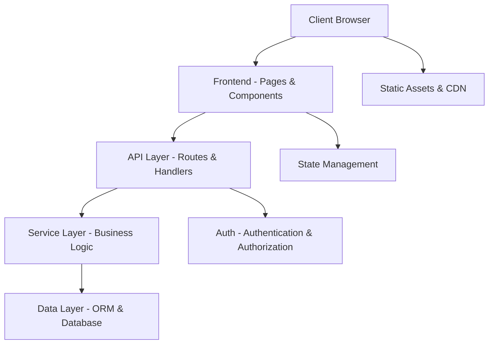

# Technical Architecture (ARCHITECTURE.md)

This document defines the technical structure, module responsibilities, data flow, and quality standards of the application. Every developer and AI agent must adhere to this architecture.

---

## 1. System Architecture

---

## 2. Directory Structure & Responsibilities

| Directory / File | Responsibility |
| :--- | :--- |
| `src/app/` or `src/pages/` | Page routes and layouts (framework-dependent) |
| `src/components/` | Reusable UI components (buttons, cards, modals, forms, nav) |
| `src/components/ui/` | Primitive design system components |
| `src/lib/` | Shared utilities, helpers, and configuration |
| `src/services/` | Business logic and external API integrations |
| `src/hooks/` | Custom React/framework hooks |
| `src/api/` or `src/server/` | Backend API routes, handlers, and middleware |
| `src/db/` | Database schema, migrations, and seed files |
| `src/types/` | TypeScript type definitions and interfaces |
| `src/styles/` | Global CSS, design tokens, and theme configuration |
| `public/` | Static assets (images, fonts, favicon) |
| `tests/` | Unit, integration, and E2E test files |

---

## 3. Frontend Architecture
1. **Component Hierarchy**:
   - Layout components (Header, Sidebar, Footer) wrap page content.
   - Page components compose feature-specific components.
   - UI primitives (`Button`, `Input`, `Card`, `Modal`) follow `STYLE_GUIDE.md`.
2. **State Management**:
   - Server state via data fetching (SWR, TanStack Query, or framework built-in).
   - Client state via React Context, Zustand, or framework stores.
3. **Styling**:
   - CSS custom properties (`:root` tokens) defined in `STYLE_GUIDE.md`.
   - No inline styles or ad-hoc hex colors.

---

## 4. Backend & API Architecture
1. **API Design**:
   - RESTful conventions with proper HTTP methods and status codes.
   - Input validation on all endpoints (Zod schemas preferred).
   - Uniform response envelopes: `{ success: true, data }` and `{ success: false, error: { code, message, details? } }`.
2. **Authentication**:
   - Session or token-based auth with secure cookie/header handling.
   - Protected routes enforce auth middleware.
3. **Database**:
   - ORM-managed schema with migrations.
   - Parameterized queries only (no string concatenation).

---

## 5. Quality & Performance Rules
1. **Security**: Secrets in `.env` only, CORS configured, CSRF protection, XSS-safe rendering.
2. **Performance**: Lazy loading for heavy components, image optimization, code splitting.
3. **Accessibility**: Semantic HTML, ARIA where needed, keyboard navigable, color contrast compliant.
4. **SEO**: Proper `<title>`, `<meta>`, heading hierarchy, OpenGraph tags, structured data.
