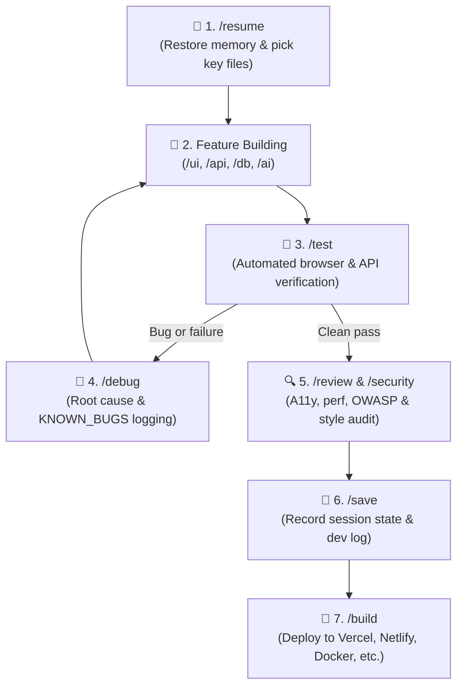

# 🚀 Agentic Fullstack Template (Solo Dev Kit)

[](https://opensource.org/licenses/MIT)
[](#-tech-stack-philosophy)
[](#-slash-commands--skills)
[](#-quality-standards)

A professional, framework-agnostic **Fullstack Web Application** development template and cognitive workflow kit optimized for **solo developers pair-programming with AI coding agents** (Antigravity IDE, Claude, Cursor, Copilot).

---

## 💡 Why This Template?

Building fullstack applications with AI coding assistants can quickly lead to context explosion, spaghetti code, security gaps, inconsistent UI, and broken deployments.

This repository solves these challenges with:
- **Framework-Agnostic**: Works with Next.js, Vite+React, SvelteKit, Astro, Express, or any modern stack.
- **Skill-First Cognitive System**: Automated AI behaviors via discrete slash commands (`/init`, `/api`, `/db`, `/ai`, `/security`, `/test`, `/save`).
- **Single Source of Truth**: All architecture, product requirements, styling tokens, security audits, and bug logs live in `.agents/blueprint/`.
- **Long-Term Memory**: Seamlessly switch chats and save tokens without losing project context or architectural state.
- **Production Domain Standards**: Dedicated, battle-tested skills for backend APIs (Zod validation), database schemas & migrations, AI/LLM streaming, and OWASP security scans.

---

## 🔄 The Solo Developer Loop

When developing with an AI assistant, maintain a disciplined, high-velocity loop:



---

## ⚡ Slash Commands & Skills

Control your AI assistant with crisp, standardized commands:

### 🔄 Lifecycle & Quality Commands
| Command | Skill | Description |
| :--- | :--- | :--- |
| `/resume` | `app-memory` | **Start of Day**: Restores memory from `SESSION_STATE.md` and loads only 2–4 key files to minimize token usage. |
| `/init` | `app-init` | **New Project**: Triggers a 6-question *Grill-Me* design interview, writes the blueprint, and scaffolds a working application. |
| `/onboard` | `app-onboard` | **Legacy Audit**: Dissects existing codebases, audits architecture/dependencies, and generates a blueprint structure. |
| `/test` | `app-test` | **Automated Testing**: Runs the app in a browser subagent, checking page load, navigation, forms, console errors, and responsive layout. |
| `/test-unit` | `app-test-unit` | **Unit & API Testing**: Sets up and runs Vitest/Jest, testing validation schemas, services, API endpoints, and coverage. |
| `/ci` | `app-ci` | **CI/CD Automation**: Generates GitHub Actions pipelines, automated typecheck/lint/test gates, and Dependabot config. |
| `/docs` | `app-docs` | **Studio Documentation**: Generates full studio suite (`/docs --all`) or targeted: Standard README, CHANGELOG, RUNBOOK, API docs, ADRs. |
| `/debug` | `app-debug` | **Diagnostics**: Locates root causes (hydration errors, API failures, auth issues, CORS, build errors) and updates `KNOWN_BUGS.md`. |
| `/review` | `app-review` | **Quality Assurance**: Audits for code quality, accessibility compliance, performance bottlenecks, and style drift. |
| `/save` | `app-memory` | **End of Day**: Compiles session achievements, logs next steps in `SESSION_STATE.md` and commits to `DEV_LOG.md`. |
| `/build` | `app-deploy` | **Deployment**: Prepares production builds and packages for Vercel, Netlify, Docker, or GitHub Pages. |

### 🛠️ Specialized Domain Commands
| Command | Skill | Description |
| :--- | :--- | :--- |
| `/ui` | `app-ui` | **Component Building**: Generates accessible, responsive UI components strictly adhering to `STYLE_GUIDE.md` design tokens. |
| `/api` | `app-api` | **Backend Routes**: Creates standardized endpoints with strict Zod validation, auth guards, and `{ success, data, error }` envelopes. |
| `/db` | `app-db` | **Database & ORM**: Designs relational schemas, indexes foreign keys, creates migrations (Prisma/Drizzle/Supabase), and writes seed scripts. |
| `/ai` | `app-ai` | **AI & LLMs**: Integrates production AI (Vercel AI SDK/OpenAI/Gemini/Anthropic) with streaming, structured Zod outputs, and cost controls. |
| `/email` | `app-email` | **Transactional Email**: Integrates React Email templates, provider clients (Resend/SendGrid), and deliverability (SPF/DKIM). |
| `/perf` | `app-perf` | **Performance & Vitals**: Audits and optimizes Core Web Vitals (LCP, INP, CLS), bundle size, code splitting, and caching. |
| `/security` | `app-security` | **Security Audit**: Scans for OWASP Top 10 flaws, hardcoded secrets, injection risks, auth leaks, and CVEs, logging to `SECURITY_AUDIT.md`. |

---

## 📁 Repository Structure

```text
.
├── .agents/
│   ├── blueprint/              # 📌 Persistent Single Source of Truth
│   │   ├── PRD.md              # Product Requirements Document (features, user stories, acceptance criteria)
│   │   ├── ARCHITECTURE.md     # System architecture (frontend, backend, database, API, auth)
│   │   ├── STYLE_GUIDE.md      # 🎨 Design System: CSS tokens, component standards, responsive breakpoints
│   │   ├── SECURITY_AUDIT.md   # 🛡️ Security scorecard, OWASP Top 10 log & vulnerability register
│   │   ├── PROJECT_STATUS.md   # Current status, feature matrix, roadmap & technical debt
│   │   ├── CODE_REVIEW.md      # Quality scorecards: performance, security, a11y, SEO (A–F)
│   │   ├── KNOWN_BUGS.md       # Root-cause bug registry and fixed issues
│   │   ├── SESSION_STATE.md    # 🧠 Handoff baton between AI conversations
│   │   └── DEV_LOG.md          # 📜 Chronological developer diary
│   ├── rules/
│   │   └── fullstack-dev.md    # Non-negotiable fullstack dev rules (security, a11y, performance)
│   └── skills/                 # ⚡ Autonomous agent tools & execution prompts
│       ├── app-init/           # Scaffolding and Grill-Me interview logic
│       ├── app-onboard/        # Codebase discovery and architecture mapping
│       ├── app-ui/             # Component building with design tokens & a11y
│       ├── app-api/            # Standardized API routes with Zod validation
│       ├── app-db/             # Schema modeling, migrations, and seed scripts
│       ├── app-ai/             # LLM streaming, structured output, and prompts
│       ├── app-email/          # Transactional email and React Email templates
│       ├── app-perf/           # Core Web Vitals, bundle analysis, and caching
│       ├── app-security/       # OWASP Top 10 and vulnerability scanning
│       ├── app-review/         # Security, performance, a11y, and style audits
│       ├── app-test/           # Automated browser verification
│       ├── app-test-unit/      # Automated unit, integration, and API testing
│       ├── app-ci/             # GitHub Actions CI/CD and automated pipeline
│       ├── app-docs/           # Studio documentation suite (Standard README, CHANGELOG, RUNBOOK, API, ADRs)
│       ├── app-debug/          # Diagnostic workflows
│       ├── app-memory/         # Token-efficient save/resume protocol
│       └── app-deploy/         # Deployment & distribution packaging
├── AGENTS.md                   # 🎯 Primary AI Agent instruction card
├── README.md                   # 📖 Project documentation
└── .gitignore                  # 🛡️ Clean repository guard
```

---

## 🛠️ Tech Stack Philosophy

This template is **framework-agnostic**. When initialized (`/init`), the Grill-Me interview determines your preferred stack and scaffolds accordingly:

- **Frontend**: Next.js, Vite+React, SvelteKit, Astro, or vanilla HTML/CSS/JS
- **Backend**: Next.js API routes, Express, Fastify, Hono, or serverless functions
- **Database**: PostgreSQL, SQLite, MongoDB, Supabase, Firebase, or Prisma/Drizzle ORM
- **AI**: Vercel AI SDK, OpenAI, Anthropic Claude, Google Gemini
- **Auth**: NextAuth, Clerk, Supabase Auth, custom JWT, or session-based
- **Deployment**: Vercel, Netlify, Docker, Railway, Fly.io, or GitHub Pages

---

## 🔒 Quality Standards

Every project initialized with this template inherits built-in quality gates:

1. **Security**: Environment variables for secrets, input validation, CORS configuration, XSS/CSRF prevention, parameterized database queries.
2. **Accessibility (WCAG 2.1 AA)**: Semantic HTML, keyboard navigation, ARIA attributes, color contrast ratios, screen reader compatibility.
3. **Performance (Core Web Vitals)**: Lazy loading, code splitting, image optimization, efficient caching, bundle size monitoring.
4. **SEO**: Proper meta tags, structured data, semantic heading hierarchy, sitemap generation, OpenGraph social sharing.
5. **Code Quality**: Consistent design tokens (no ad-hoc styles), ESLint/Prettier integration, TypeScript encouraged.

---

## 🚀 Quick Start

### 1. Clone or Template
```bash
git clone https://github.com/Samrude1/agentic-fullstack-template.git my-app
cd my-app
```

### 2. Launch in your AI IDE
Open the folder in **Antigravity IDE**, **Cursor**, or your favorite AI coding environment.

### 3. Kick off your project
In your chat prompt, simply type:
```
/init
```
The agent will guide you through the 4-question project concept interview, generate your custom PRD and architecture, and scaffold a working application.

---

## 📄 License

This project is licensed under the [MIT License](LICENSE). Feel free to use it for personal, commercial, or client projects!
