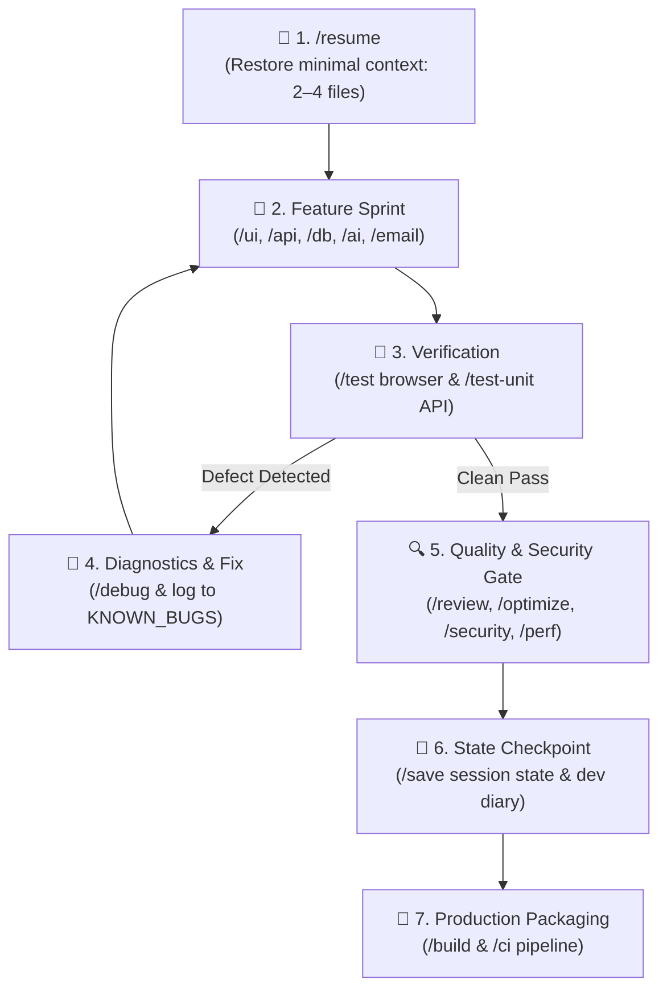

# ⚡ Agentic Fullstack Development System (Solo Dev Kit)

[](https://opensource.org/licenses/MIT)
[](#-architectural-pillars)
[](#-framework-agnostic-scaffolding)
[](#-enterprise-grade-quality-gates)
[](#-enterprise-grade-quality-gates)

A production-grade, framework-agnostic **Cognitive Development Environment and Governance Template** engineered for developers building mission-critical fullstack web applications with autonomous AI coding agents (Antigravity IDE, Cursor, Claude Code, Copilot).

---

## 🎯 Executive Summary & Value Proposition

Trained LLMs are exceptionally fast code generators, but without deterministic rails they introduce **architectural drift, security vulnerabilities, and context degradation**. 

Most AI-generated codebases fail in production not because the model writes bad code, but because **the development loop lacks architectural constraints, automated regression gates, and state persistence**.

**Agentic Fullstack Template** bridges the gap between stochastic AI generation ("vibe coding") and disciplined, studio-grade software engineering. It provides a turn-key cognitive operating system that forces AI agents to adhere to strict single-source-of-truth blueprints, automated testing gates, and OWASP security standards from day zero.

### 💼 Quantifiable ROI for AI Professionals & Engineering Leads

| Problem in Modern AI Development | How This System Solves It | Quantifiable Impact |
| :--- | :--- | :--- |
| **Context Window Degradation ("Context Rot")** | **Targeted State Handoff (`app-memory`)**: Reads only 2–4 essential blueprint files per session via `SESSION_STATE.md`. | **Up to 70% reduction in token consumption**; eliminates hallucinatory context drift. |
| **Architectural & Design Drift** | **Single Source of Truth (`.agents/blueprint/`)**: CSS `:root` design tokens, component rules, and unified Zod envelopes. | **Zero ad-hoc styling or rogue API contracts** across long-running development sprints. |
| **Security & Compliance Blindspots** | **Shift-Left Security Scanner (`app-security`)**: Built-in OWASP Top 10 scanning, secret leak detection, and parameterized queries. | **Prevents critical CVEs** and unvalidated payloads before code touches version control. |
| **Production Deployment Failure** | **Studio Operations Suite (`app-ci`, `app-docs`)**: Automated GitHub Actions CI, Vitest test suites, and operational runbook. | **Instant emergency rollback (< 30s)**, automated type/lint/test gates, and health monitoring. |

---

## 🏛️ Architectural Pillars

```
.agents/
├── blueprint/          # 📌 Single Source of Truth (PRD, Architecture, Style, Status, Security)
├── rules/              # 🛡️ Non-Negotiable Fullstack Development Standards
└── skills/             # ⚡ 18 Autonomous Agent Capabilities (Execution Workflows)
```

1. **Persistent Single Source of Truth (`.agents/blueprint/`)**:
   Every architectural decision, data contract, visual token, and feature status is grounded in version-controlled markdown specifications. The agent never guesses requirements or invents ad-hoc patterns.
2. **Deterministic Governance (`.agents/rules/fullstack-dev.md`)**:
   Hard constraints that the agent cannot violate: mandatory Zod input validation, standardized `{ success, data, error }` response envelopes, parameterized queries, and mobile-first WCAG 2.1 AA accessibility.
3. **Autonomous Execution Skills (`.agents/skills/`)**:
   18 structured capabilities equipped with validation checklists, error recovery, and tool invocations.

---

## 🔄 The Solo Developer Closed Loop

A disciplined development cycle that maintains high engineering velocity while guaranteeing zero quality regression:



---

## ⚡ Complete Agent Skills & Slash Command Matrix

The system arms your AI coding assistant with **18 production skills** divided into lifecycle automation and specialized engineering domains:

### 🔄 Lifecycle & Governance Skills (11)
| Command | Skill | Domain / Scope | Technical Deliverables |
| :--- | :--- | :--- | :--- |
| `/resume` | `app-memory` | **Session Bootstrapping** | Restores state from `SESSION_STATE.md`; loads only 2–4 targeted files to preserve context window. |
| `/init` | `app-init` | **Project Initialization** | Executes interactive 6-question *Grill-Me* interview, writes blueprint, scaffolds stack. |
| `/onboard` | `app-onboard` | **Codebase Discovery** | Audits legacy or existing repositories; reverse-engineers full `.agents/blueprint/` specifications. |
| `/test` | `app-test` | **Automated Browser E2E** | Runs headless browser subagent: validates rendering, console exceptions, responsive layout, and forms. |
| `/test-unit` | `app-test-unit` | **Automated Unit & API Testing** | Configures and runs Vitest/Jest test suites, Zod schema validation, API contracts, and coverage gates. |
| `/ci` | `app-ci` | **Pipeline Engineering** | Generates GitHub Actions workflow (`ci.yml`), automated typecheck/lint/test gates, and Dependabot. |
| `/docs` | `app-docs` | **Documentation Suite** | Generates Standard Readme, Keep a Changelog, REST API reference, and Production Operations Runbook. |
| `/debug` | `app-debug` | **Systematic Diagnostics** | Root-cause analysis for hydration mismatches, auth errors, CORS, and logs to `KNOWN_BUGS.md`. |
| `/review` | `app-review` | **Quality Assurance** | Audits code against WCAG 2.1 AA, Core Web Vitals, modularity, and style drift. |
| `/optimize` | `app-optimize` | **Codebase Refactoring** | Untangles spaghetti code, breaks monolithic files into single-responsibility units, and optimizes architecture. |
| `/save` | `app-memory` | **Session Handoff** | Analyzes session delta, updates `SESSION_STATE.md`, records dev log, and prepares fresh handoff. |
| `/build` | `app-deploy` | **Production Packaging** | Validates production builds, generates containerization configs (Docker), and prepares deployment assets. |

### 🛠️ Specialized Engineering Domain Skills (7)
| Command | Skill | Domain / Scope | Technical Deliverables |
| :--- | :--- | :--- | :--- |
| `/ui` | `app-ui` | **Design System & Components** | Builds accessible UI components strictly adhering to CSS tokens in `STYLE_GUIDE.md` (Light & Dark). |
| `/api` | `app-api` | **Backend Routes & Middleware** | Constructs standardized endpoints with Zod payload validation, auth guards, and `{ success, data, error }`. |
| `/db` | `app-db` | **Database & Migrations** | Relational data modeling, indexed foreign keys, ORM migrations (Prisma/Drizzle/SQL), and seed fixtures. |
| `/ai` | `app-ai` | **Production LLM Integration** | Streaming chat, structured Zod object generation, prompt externalization, and token budget guards. |
| `/email` | `app-email` | **Transactional Email** | React Email templates, multi-provider clients (Resend/SendGrid), and delivery compliance (SPF/DKIM). |
| `/perf` | `app-perf` | **Performance Engineering** | Core Web Vitals profiling (INP < 200ms, LCP < 2.5s), bundle size analysis, dynamic imports, and HTTP caching. |
| `/security` | `app-security` | **Security & Compliance** | OWASP Top 10 vulnerability scanner, hardcoded secret detection, SQL injection checks, and CORS policy audit. |

---

## 🛠️ Framework-Agnostic Scaffolding

This template is deliberately **framework-agnostic**. Rather than locking developers into a rigid starter kit, `/init` conducts an architectural interview and scaffolds the exact stack required:

- **Frontend**: Next.js (App Router), Vite + React, SvelteKit, Astro, or vanilla HTML/CSS/JS.
- **Backend**: Next.js Server Actions / Route Handlers, Express, Fastify, Hono, or serverless functions.
- **Data & Persistence**: PostgreSQL, SQLite, Supabase, MongoDB, with Prisma, Drizzle, or raw SQL.
- **Authentication**: NextAuth, Clerk, Supabase Auth, Firebase, or custom JWT with HTTP-only cookies.
- **Deployment**: Vercel, Netlify, Docker multi-stage containers, Railway, Fly.io, or static GitHub Pages.

---

## 🔒 Enterprise-Grade Quality Gates

Every project initialized from this template inherits industrial-strength software engineering standards:

```text
┌────────────────────────────────────────────────────────────────────────┐
│                        BUILT-IN QUALITY GATES                          │
├────────────────────────────────────────────────────────────────────────┤
│ 🛡️  Security:      OWASP Top 10 compliance, Zod sanitization, .env     │
│ ♿  Accessibility: WCAG 2.1 AA compliant, visible focus, ARIA-ready    │
│ ⚡  Performance:    Core Web Vitals (LCP < 2.5s, INP < 200ms, CLS < 0.1) │
│ 🧪  Verification:   Vitest unit testing + automated browser subagent   │
│ 🚨  Resilience:     Ops Runbook, health probes, emergency rollback     │
└────────────────────────────────────────────────────────────────────────┘
```

---

## 🚀 Quick Start

### 1. Clone the Template
```bash
git clone https://github.com/Samrude1/agentic-fullstack-template.git my-app
cd my-app
```

### 2. Launch in your AI-Native IDE
Open the directory in **Antigravity IDE**, **Cursor**, or your preferred AI coding environment.

### 3. Initialize your Architecture
In your agent chat interface, simply invoke:
```text
/init
```
The agent will execute the 6-question *Grill-Me* design interview, establish your custom `.agents/blueprint/` specifications, scaffold your chosen stack, and launch your first verified feature sprint.

---

## 📄 License & Attribution

Distributed under the **MIT License**. Free for personal, commercial, enterprise, and client development. Built for high-velocity software engineers who demand production-grade quality.
